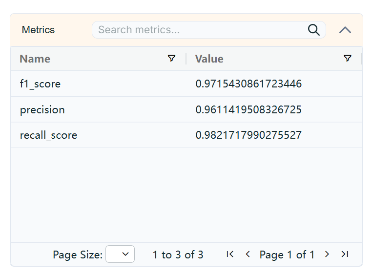
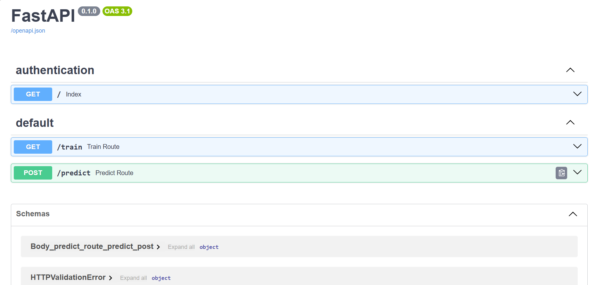

# 🔍 Phishing URL Detection using Machine Learning

## 📌 Project Overview
This project focuses on detecting **phishing websites** using **URL-based features** and machine learning models.  
By analyzing 30+ attributes such as URL structure, SSL certificate details, domain age, and abnormal web behaviors, the model can classify websites as **legitimate** or **phishing**.  

Key Highlights:  
- ✅ Built multiple ML models and compared their performance  
- ✅ Logged & tracked experiments with **MLflow** hosted on **DagsHub**  
- ✅ Deployed using **FastAPI** for real-time detection  
- ✅ CI/CD automation with **GitHub Actions**  
- ✅ Integrated with **AWS S3, EC2, and MongoDB Atlas** for cloud storage & scalability  

---

## 🏗 Tech Stack
- **Languages & Libraries:** Python, Scikit-learn, Pandas, NumPy  
- **Experiment Tracking:** MLflow + DagsHub  
- **Deployment:** FastAPI  
- **Cloud & Storage:** AWS (S3, EC2), MongoDB Atlas  
- **CI/CD:** GitHub Actions  

---

## 📊 Features Used for Prediction
The dataset includes **30+ features** that indicate whether a URL is suspicious or safe:  

- **URL Structure:** IP Address in URL, URL Length, `@` Symbol, Double Slash Redirects, Prefix/Suffix  
- **Security Indicators:** SSL State, HTTPS Tokens, Port, Favicon  
- **Domain Info:** Registration Length, Age of Domain, DNS Records  
- **Behavioral Indicators:** Redirects, Right Click Disabled, Mouseover Tricks, Pop-ups, Iframes  
- **Popularity Metrics:** Web Traffic, PageRank, Google Index, Links Pointing to Page  
- **Anomalies:** Abnormal URLs, Submitting to Email, Statistical Reports  

---

## 🚀 Project Workflow
1. **Data Preprocessing** → Encoded and cleaned 30+ features  
2. **Model Training** → Applied multiple ML classifiers and tuned hyperparameters  
3. **Experiment Tracking** → Logged results in **MLflow** hosted on **DagsHub**  
     
4. **Deployment** → Built **FastAPI** app for phishing detection  
     
5. **CI/CD & Cloud Integration** → Automated pipelines with GitHub Actions, stored data/models on AWS S3 & MongoDB  

---

## 📸 Screenshots
- Dagshub Tracking UI  
- FastAPI Swagger Docs  
- CI/CD Pipeline Success  
- AWS S3 & MongoDB Atlas Integration  

*(Add your screenshots inside an `images/` folder and reference them like above)*  

---

## 📦 Installation & Usage
Clone the repository:
```bash
git clone https://github.com/Arvik07/ML_project3
cd ML_project3
